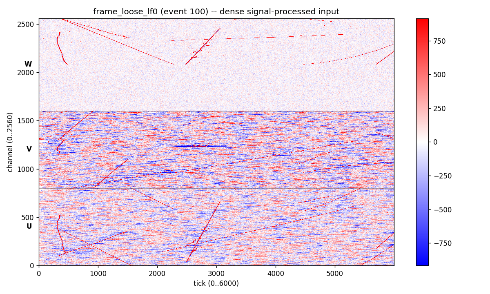
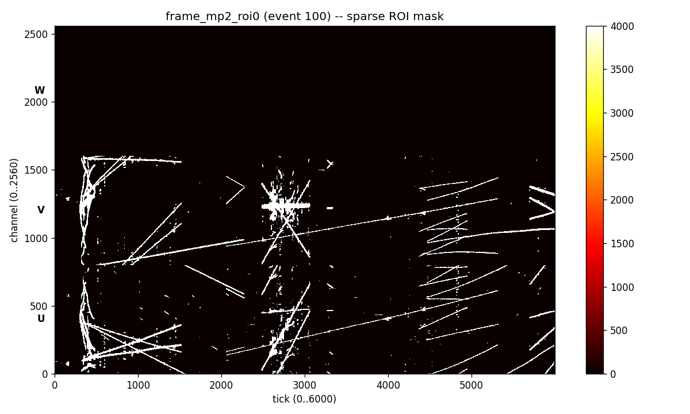
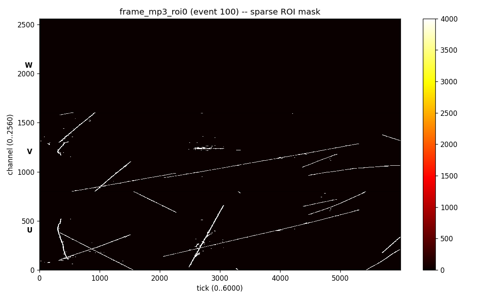
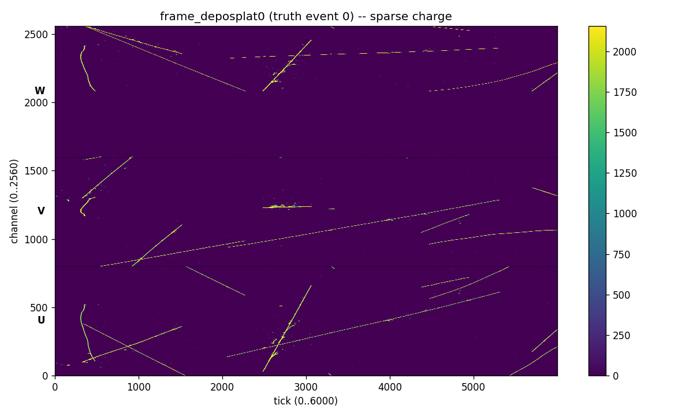
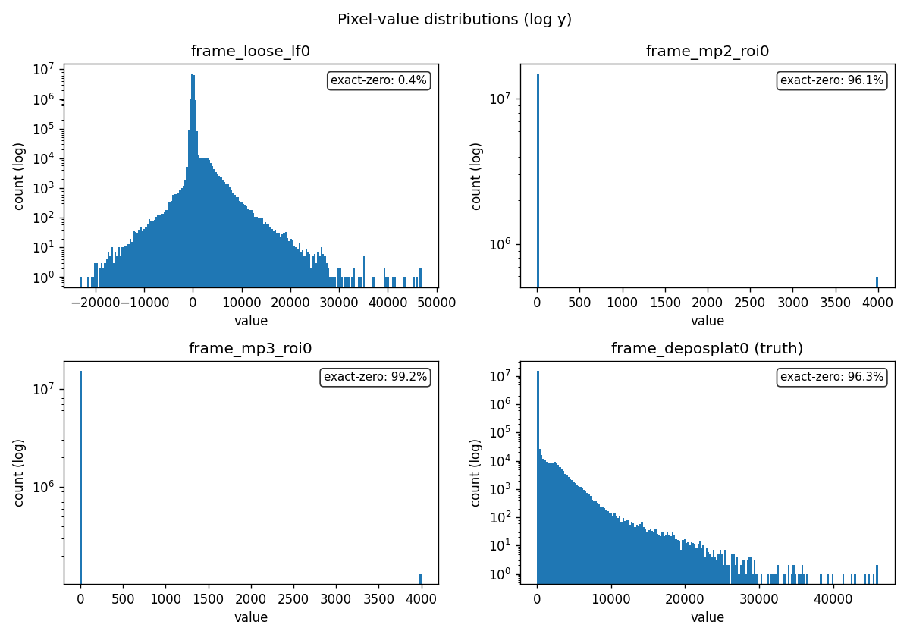
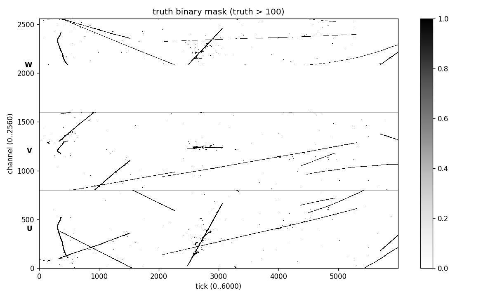
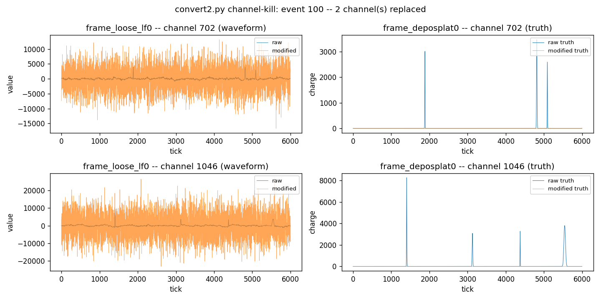
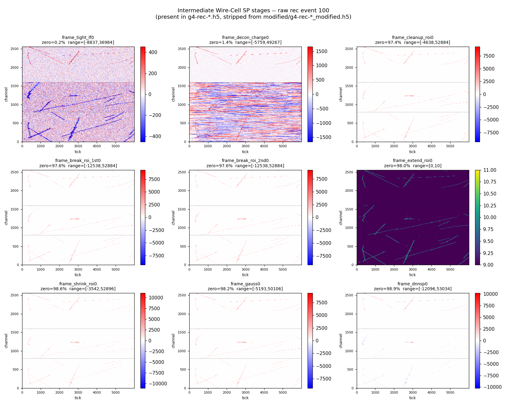

# PDHD training data — what's inside

A walking tour of one event from hnam's PDHD training set, with figures generated by [`inspect_pdhd_event.py`](./inspect_pdhd_event.py). All numbers below come from the actual file (`g4-rec-0.h5`, event 100 / truth event 0); reproduce them with:

```bash
python docs/pdhd_data/inspect_pdhd_event.py
```

Cross-references:
- File locations & sizes: [hnam_data.md](../hnam_data.md)
- How the input is built from these frames at train time: [hnam_input_preprocessing.md](../hnam_input_preprocessing.md)
- How the binary mask is built from the truth charge: [hnam_truth_labeling.md](../hnam_truth_labeling.md)

## 1. Files and event-id convention

| File | What it holds |
| --- | --- |
| `train_data_PDHD_fixedbug_separateWC/g4-rec-{i}.h5` | Raw reconstructed frames + many intermediate signal-processing stages |
| `train_data_PDHD_fixedbug_separateWC/g4-tru-{i}.h5` | Raw Geant4 truth charge |
| `train_data_PDHD_fixedbug_separateWC/modified/g4-rec-{i}_modified.h5` | Same as raw rec but stripped to the 3 stages the network eats, with channel-kill augmentation applied to one event |
| `train_data_PDHD_fixedbug_separateWC/modified/g4-tru-{i}_modified.h5` | Same as raw tru with matching channels zeroed for the augmented event |

Each file contains **10 event groups**. Rec groups are numbered `100..109`; tru groups `0..9`. Pairing: **rec event N ↔ tru event N − 100**.

## 2. Inventory — where, how many, how augmented

**Where the data lives**

| Path | Role |
| --- | --- |
| `/nfs/data/1/hnam/train_data_PDHD_fixedbug_separateWC/` | Absolute path on WCGPU1 (owner: `hnam`) |
| `./train_data_PDHD_fixedbug_separateWC` | Symlink in this repo (created earlier) — same target |
| `./hnam/train_data_PDHD_fixedbug_separateWC` | Same target, reached via the `hnam` symlink |

Top-level layout inside the directory:

```
train_data_PDHD_fixedbug_separateWC/
├── g4-rec-{i}.h5            # 59 raw rec files, i ∈ {0..59} \ {2}
├── g4-tru-{i}.h5            # 59 matching truth files
├── convert.py               # earlier preprocessing (×10 amplification)
├── convert2.py              # current preprocessing (Gaussian-noise replacement)
├── modified/                # 33 GB — CURRENT training input (convert2.py output)
│   ├── g4-rec-{i}_modified.h5
│   ├── g4-tru-{i}_modified.h5
│   └── convert2.log         # per-file log of (event, channels) chosen by seed=42
├── modified_convert1/       # 33 GB — older convert.py output (kept for reference)
│   ├── g4-rec-{i}_modified.h5
│   └── g4-tru-{i}_modified.h5
├── modified_rec/            # empty staging dir (convert*.py initially writes here)
├── modified_tru/            # empty staging dir
├── noised/                  # empty (abandoned earlier experiment)
└── script/
    ├── check_h5_shapes.py   # generic data-shape validator
    └── issues.csv           # output of running it on /nfs/data/1/renney/... (NOT this set)
```

Total size on disk: ~168 GB raw, ~33 GB under `modified/`, another ~33 GB under `modified_convert1/`.

### `modified/` vs `modified_convert1/`

Both directories hold "augmented" copies of the same 59 file pairs; **only the augmentation step differs**. From `diff convert.py convert2.py`, the one-line difference inside the channel-kill loop is:

```python
# convert.py  -> modified_convert1/
data[:, chosen_channels] *= 10                                 # just amplify ×10

# convert2.py -> modified/
data[:, chosen_channels] = N(pedestal, rms × U(2,15))          # replace with Gaussian noise
```

The seed is identical (`np.random.default_rng(seed=42)`), so the **same events and channels** are selected in both — only the resulting waveform differs:

| Dataset | Affected channels in `frame_loose_lf0` | Truth side (`frame_deposplat0`) |
| --- | --- | --- |
| `modified_convert1/` | Original waveform × 10 | Same channels zeroed |
| `modified/` (current) | Gaussian noise, pedestal preserved, RMS × U(2, 15) | Same channels zeroed |

`train4.py` line 80 hardcodes the **`modified/`** path, so training only consumes the `convert2.py` outputs. `modified_convert1/` is effectively a snapshot of the previous augmentation scheme — useful if you want to compare model behavior across augmentation strategies, but not on the live training path.

### Per-file augmentation log

`modified/convert2.log` records the picks for every file. First three entries:

```
g4-rec-0  -> event 100, channels [702, 1046]
g4-rec-1  -> event 108, channel  [1503]
g4-rec-3  -> event 104, channel  [121]
```

so if you want to verify the augmentation on any specific file/event, just grep this log instead of diffing against the raw file.

### Empty staging dirs

`modified_rec/` and `modified_tru/` are the directories `convert*.py` writes to (see the script source: `out_rec_dir = base_dir + "modified_rec"`). After a run, hnam moves the outputs into either `modified/` (convert2) or `modified_convert1/` (convert) and leaves the staging dirs empty. `noised/` is from an even earlier attempt and is empty.

### `script/` directory

Holds `check_h5_shapes.py` — a generic validator that walks every event in every file and reports shape mismatches against the expected `(2560, 6000)` (rec) and `(2080, 6000)` (truth-W). `issues.csv` is the run output, but its `file` column points at **`/nfs/data/1/renney/PDHD_Training_Sample/...`** — i.e. it was run on a *different* colleague's dataset, not the hnam set. So it's a leftover artifact rather than a list of issues with the data we're using.

**How many events**

- **59 file pairs** (file index `i ∈ 0..59` with **`i=2` missing** — both `g4-rec-2.h5` and `g4-tru-2.h5` were never produced).
- **10 events per file** (rec groups `100..109`, tru groups `0..9`).
- **590 events total** in both raw and modified sets.

Default `train4.sh` settings (`STRAIN=0 NTRAIN=90 SVAL=90 NVAL=10`) use only the first **100 events** (first 9 files for train, 10th file for val); the remaining ~490 events sit unused unless you bump `NTRAIN`/`NVAL`. The index → (file, event) map in `train4.py:128–137`:

```python
def id_gen_rec(index):
    return (index // 10, index % 10 + 100)   # file positional index, rec event id
```

is positional over the 59-element file list, so `index=0..89` maps to file slots 0..8, which after skipping i=2 are actual files {0, 1, 3, 4, 5, 6, 7, 8, 9}.

**How many "dead" channels added by hand**

`convert2.py` injects 1 or 2 random channels per file in **one** randomly-chosen event (`np.random.default_rng(seed=42)`). The seed is fixed, so the augmentation is deterministic. Empirical count over all 59 modified files:

| Files with 1 noise-injected channel | Files with 2 noise-injected channels | **Total dead channels** |
| ---: | ---: | ---: |
| 34 | 25 | **84** |

So 84 (file, event, channel) augmentations across the modified set — i.e. one bad-channel example for every ~7 events of training data. Other events in those same files (and all events of the unaffected channels) remain pristine. The truth side has those same 84 channel-events zeroed.

The script `inspect_pdhd_event.py --event <ID>` discovers the affected channels automatically by diffing against the raw file, so you can probe any event without consulting `convert2.py`.

## 3. Dimensions

Every dataset is **`float32[2560, 6000]`** per event group (after `h5_utils.load()` auto-transposes from the on-disk `(tick, channel)` layout to `(channel, tick)`).

| Axis | Size | Meaning |
| ---: | ---: | --- |
| 0 | **2560** | APA wire-channels: U = `[0, 800)`, V = `[800, 1600)`, W = `[1600, 2560)` |
| 1 | **6000** | TPC time ticks at native rate |

The network only consumes the **U + V induction planes** (`x_range = [0, 1600]`) and downsamples the time axis (`rebin = 4` → 1500 ticks). The collection plane (W, channels 1600–2560) and the last 4500 raw ticks are dropped.

## 4. The four datasets the network sees

| Dataset | Role | Sparse / dense | Stored as | Sample range | Notes |
| --- | --- | --- | --- | --- | --- |
| `frame_loose_lf0` | input ch 0 | **dense** (0.36 % exact zeros) | float charge | [-23 065, 46 853], mean 24.7 | Signal-processed waveforms; full baseline noise present everywhere |
| `frame_mp2_roi0` | input ch 1 | **sparse** (96.14 % zeros) | float, clipped [0, 4000] | mean 154.3 over non-zero | Multi-plane ROI mask, only narrow bands are non-zero |
| `frame_mp3_roi0` | input ch 2 | **sparse** (99.15 % zeros) | float, clipped [0, 4000] | mean 34.0 over non-zero | Same idea as mp2, stricter (sparser) ROI |
| `frame_deposplat0` | truth | **sparse** (96.29 % zeros) | float charge | [0, 46 071], mean 27.6 | Geant4 deposited charge per pixel — **not pre-binarized** |

The exact numbers above come from `summary.txt` in `png/`, regenerated each run.

### Heatmaps

`frame_loose_lf0` — dense baseline + visible track signal (note the "U"/"V"/"W" labels mark the channel-plane separators):



`frame_mp2_roi0` — sparse ROI mask (mostly black):



`frame_mp3_roi0` — even sparser ROI mask:



Truth charge `frame_deposplat0` — sparse, but the values are continuous charges, not 0/1:



### Value distributions

The four datasets' pixel-value distributions on a log y axis. `loose_lf0` is the only one centered around 0 with a wide spread — everything else has a giant zero spike:



## 5. Binary vs charge

Every stored value in every dataset is a **float charge** value. **None of them are pre-binarized.**

The binary mask the network is trained against is built **online** during training, inside `utils/h5_utils.py:get_masks()`:

```python
mask = truth > truth_th   # truth_th = 100 by default
# then padded along the time axis -- see hnam_truth_labeling.md
```

For event 100 with `truth_th = 100`, only **1.36 %** of truth pixels survive thresholding — the loss is computed on a tightly localized mask.

`truth > 100` for this event:



## 6. Channel-kill augmentation

For one randomly-chosen event per file, `convert2.py` replaces the waveform of **1 or 2 random channels** in `frame_loose_lf0` with Gaussian noise (same pedestal, RMS × 2–15), and zeros the same channels in `frame_deposplat0`. In `g4-rec-0_modified.h5` the augmented event is **100** and the affected channels are **702** and **1046** — confirmed empirically by the script:



Top row (channel 702): the modified waveform replaces the original (small) baseline noise with a wide Gaussian band, while the corresponding truth peaks disappear. Same story for channel 1046. Other events in the same file are byte-identical to the raw rec/tru.

Full procedure: [hnam_input_preprocessing.md](../hnam_input_preprocessing.md#stage-a--convert2py-channel-kill-augmentation-pdhd-only).

## 7. Intermediate Wire-Cell SP stages (raw file only)

The **raw** `g4-rec-0.h5` carries **12 frame stages** per event — the network only consumes 3, but the others are present for debugging and ablation. The `modified/` rec strips them to save ~75 % disk while preserving everything training needs.

| Dataset | Shape | Zero% | Range | Notes |
| --- | --- | ---: | --- | --- |
| `frame_loose_lf0` | (2560, 6000) | 0.36 | [-23 k, 47 k] | **input ch 0** — kept in modified |
| `frame_mp2_roi0` | (2560, 6000) | 96.14 | [0, 4000] | **input ch 1** — kept in modified |
| `frame_mp3_roi0` | (2560, 6000) | 99.15 | [0, 4000] | **input ch 2** — kept in modified |
| `frame_tight_lf0` | (2560, 6000) | 0.16 | [-8.8 k, 37 k] | Tight low-frequency filter — dense, like loose_lf0 |
| `frame_decon_charge0` | (2560, 6000) | 1.39 | [-5.8 k, 49 k] | Deconvoluted charge after SP — dense, bipolar |
| `frame_cleanup_roi0` | (2560, 6000) | 97.43 | [-4.6 k, 53 k] | Sparse ROI-filtered charge |
| `frame_break_roi_1st0` | (2560, 6000) | 97.56 | [-12.5 k, 53 k] | 1st pass of ROI break-up |
| `frame_break_roi_2nd0` | (2560, 6000) | 97.58 | [-12.5 k, 53 k] | 2nd pass of ROI break-up |
| `frame_extend_roi0` | (2560, 6000) | 97.99 | [0, 10] | Small-integer ROI extension mask |
| `frame_shrink_roi0` | (2560, 6000) | 98.57 | [-3.5 k, 53 k] | ROI-shrunk charge |
| `frame_gauss0` | (2560, 6000) | 98.18 | [-5.2 k, 50 k] | Gaussian-filtered SP output |
| `frame_dnnsp0` | (2560, 6000) | 98.88 | [-12 k, 53 k] | Placeholder/output slot for DNN-SP — sparse |

These all match the standard Wire-Cell signal-processing pipeline:

```
raw → loose_lf / tight_lf  (low-frequency filters)
     → decon_charge        (Wiener deconvolution)
     → cleanup / break_roi / extend / shrink (ROI builders)
     → gauss               (Gauss-filter version of the charge)
     → mp2 / mp3           (multi-plane ROI variants)
     → dnnsp               (slot for the DNN-ROI output once deployed)
```

3×3 quick-look (auto color scale; sparse panels use 1/99 percentile of *non-zero* values so the dnnsp0 etc. panels aren't pinned to 0):



Things to notice at a glance:

- **`tight_lf0`** and **`decon_charge0`** are dense, like `loose_lf0`. They live before the ROI-builder stages, where almost every pixel still carries a baseline value.
- **`cleanup_roi0`** through **`gauss0`** are sparse — they only retain pixels inside identified ROIs.
- **`extend_roi0`** is an integer ROI-extension mask, values in **[0, 10]**.
- **`dnnsp0`** is essentially empty in this event — it's where the official DNN-ROI output would land in deployment; raw simulation files leave it as a placeholder.
- **`frame_break_roi_1st0`** and **`frame_break_roi_2nd0`** are two passes of the same ROI-break step (1st refines, 2nd cleans up); their values are nearly identical here (zero% 97.56 vs 97.58).

## 8. Other things in the files worth knowing

```
channels_*           <- int32[2560], just the enumeration 0..2559 (NOT a per-pixel mask)
tickinfo_*           <- float64[3], (TDC offset, tick width, reserved)
```

These metadata datasets exist for every frame stage. The truth file is unchanged shape-wise between raw and modified; only the channel-kill zeroing differs.

## 9. Quick reference

Default invocation:

```bash
python docs/pdhd_data/inspect_pdhd_event.py
# -> regenerates docs/pdhd_data/png/*.png and summary.txt
```

Useful flags:

```
--file       <rec.h5>      # default: modified/g4-rec-0_modified.h5
--truth      <tru.h5>      # default: modified/g4-tru-0_modified.h5
--raw-file   <raw rec.h5>  # default: g4-rec-0.h5  (for the noise comparison)
--raw-truth  <raw tru.h5>  # default: g4-tru-0.h5
--event      <id>          # default: 100  (rec event; tru event = id - 100)
--outdir     <dir>         # default: docs/pdhd_data/png
--truth-th   <float>       # default: 100
```

To inspect a non-augmented event, e.g. event 101, the noise-injection panel quietly drops itself since no channels differ between raw and modified.
